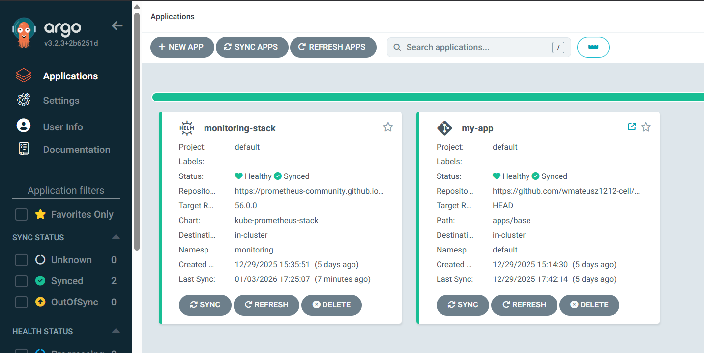

# ☁️ Hybrid-Cloud Kubernetes Platform (Homelab)


## 📋 Project Overview

This project demonstrates a production-grade **DevOps Platform** built from scratch on bare-metal Virtual Machines. It simulates a real-world scenario where a company transitions from manual operations to full automation using **Infrastructure as Code (IaC)** and **GitOps** principles.

**Key Achievements:**
* **Zero-Touch Provisioning:** Automated VM configuration using Ansible.
* **Self-Healing Infrastructure:** Implemented ArgoCD to ensure the live cluster state always matches the Git repository.
* **Full Observability:** Deployed Prometheus & Grafana stack for real-time metric analysis and alerting.
* **Automated Delivery:** Created a CI/CD pipeline that builds, scans, and deploys applications in under 2 minutes.

---

## 🏗️ Architecture & Workflow

The system is designed to be resilient and automated. The flow of data and code is as follows:

1.  **Code Commit:** Developer pushes code to GitHub.
2.  **CI (Continuous Integration):** GitHub Actions triggers a workflow to build the Docker image and push it to Docker Hub.
3.  **CD (Continuous Delivery):** ArgoCD detects the change in the manifest/image version and syncs the Kubernetes cluster.
4.  **Monitoring:** Prometheus scrapes metrics from the new pods, visualized instantly in Grafana.

---

## 📸 Project Showcase

### 1. GitOps Dashboard (ArgoCD)
*Managing application lifecycles and enforcing state consistency.*


### 2. Observability & Metrics (Grafana)
*Real-time visualization of Cluster CPU/Memory usage and Pod performance.*


### 3. CI/CD Pipeline Success
*Automated build and push process using GitHub Actions.*


### 4. Live Application (Ingress Access)
*The final application accessible via custom local domain.*


---

## 🛠️ Technology Stack

| Domain | Technology | Description |
| :--- | :--- | :--- |
| **Orchestration** | **K3s (Kubernetes)** | Lightweight, certified Kubernetes distribution optimized for Edge/IoT. |
| **Configuration** | **Ansible** | Automating OS setup, dependencies, and K3s node joining. |
| **GitOps** | **ArgoCD** | Declarative continuous delivery tool for Kubernetes. |
| **Monitoring** | **Prometheus Operator** | Cloud-native monitoring system. |
| **Visualization** | **Grafana** | Analytics and interactive visualization web application. |
| **CI/CD** | **GitHub Actions** | Automating the build, test, and deployment pipeline. |
| **Networking** | **Nginx Ingress** | Modern HTTP reverse proxy and load balancer. |

---

## 🚀 How to Replicate

If you want to build this lab yourself:

1.  **Provision VMs:** Create 2 VMs (Ubuntu 22.04) with bridged networking.
2.  **Clone Repo:** `git clone https://github.com/wmateusz1212-cell/k8s-homelab.git`
3.  **Run Ansible:**
    ```bash
    cd ansible
    ansible-playbook -i hosts.ini main-setup.yml
    ansible-playbook -i hosts.ini k3s-install.yml
    ```
4.  **Install ArgoCD:** Follow the manifests in `infrastructure/`.
5.  **Enjoy:** Access the dashboard at `https://<MASTER-IP>:30443`.

---

### 👤 Author
**Mateusz W**
*Aspiring DevOps Engineer passionate about Automation, Kubernetes, and Cloud Technologies.*
